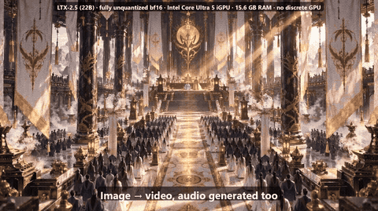
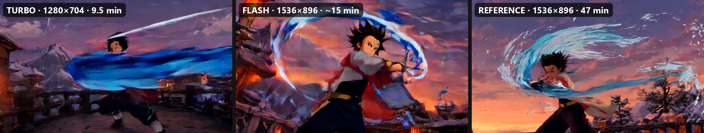

# A 22B video model, fully unquantized, on a laptop's integrated GPU

Generate video **with audio** from text or from your own image, using the full-precision **LTX-2.5 (22B)** model on an **Intel Core Ultra 5 125H iGPU with 15.6 GB of shared RAM and no discrete GPU**.
The model is ~66 GB on disk; this project streams its weights from NVMe **layer by layer** so it fits.



Full clips: [`docs/media/ltx25_igpu_highlights_1600x896.mp4`](docs/media/ltx25_igpu_highlights_1600x896.mp4) · vertical reel: [`docs/media/ltx25_igpu_reel_1080x1920.mp4`](docs/media/ltx25_igpu_reel_1080x1920.mp4)

## What this is (and is not)
- **Is:** the distilled LTX-2.5 22B DiT in **bf16 - no quantization** - plus the Gemma text encoder, video/audio VAEs and vocoder, all streamed from disk. Text-to-video, image-to-video, native audio and speech (checked with an ASR transcript).
- **Is not fast.** A single clip takes minutes to an hour on this chip (table below). The point is that it runs *at all*: this model normally wants 40+ GB of VRAM.
- **Is not a general inference library.** It is a working engine for this one model on this one machine, with the bugs and dead ends written down (see [BIBLE.md](BIBLE.md)).

## Measured on the iGPU (Core Ultra 5 125H, 15.6 GB RAM, Balanced power plan)
| Result | Settings | Time |
|---|---|---|
| Anime, 5.4 s, 1536x896 + audio (**FLASH**) | 768x448 stage 1 -> x2 latent upsample, 12 fps doubled, 1 refinement step | **~14 min** |
| Anime, 5.4 s, quick look (TURBO) | 640x352 -> 1280x704 | ~9.5 min |
| Anime, 5 s, best quality (REFERENCE) | 24 fps, 3 refinement steps | ~47 min |
| Realistic, 4 s, 1280x704 | two-stage | ~20.6 min |
| Stage 1 only (prompt/seed check) | 768x448 | ~7-8 min |
| One denoising step, 3k tokens / 12k tokens | - | ~47 s / ~240 s |


*Same prompt and seed in three modes.*

## How it works (short version)
1. The model is built on the `meta` device (no memory), and each transformer block's weights are read from the safetensors files with **unbuffered, aligned reads** into a small pinned staging buffer, copied to the GPU, used, and dropped.
2. A prefetch thread reads block *n+1* while block *n* computes, so the disk (3.65 GB/s) is hidden behind compute (the iGPU does ~3.7 TFLOPS in bf16).
3. Per-tensor repacking to 256-byte alignment (misaligned views gave NaN / OUT_OF_RESOURCES), pre-transposed Linear weights (+9 %), chunked feed-forward for the 12k-token refinement stage.
4. Two-stage distilled recipe (8 fixed sigmas at half resolution, x2 latent upsampler, refinement). Audio VAE and vocoder run in **fp32** (bf16 produced NaN = silence).

## Honest limits
- Fast, large camera or subject motion can smear or collapse for a few frames. Slow, deliberate motion is clean.
- Anime clips are generated at 12 fps and each frame shown twice ("on twos"); realistic footage needs 24 fps and takes about twice as long.
- Faces smaller than ~25 % of the frame height smear at the 800x448 working size.
- The same code has a CUDA path (`stream/dev.py`) that is **untested** on NVIDIA hardware.
- Speed estimates for other GPUs in my notes are estimates, not measurements.

## Run it
```bash
python setup_ltx.py        # resumable installer: venv, PyTorch, model download (needs a free Hugging Face login + license accept), self-tests
python render.py --mode flash --name my-clip --prompt-file prompts/anime_swordsman-bridge.txt --seed 7
python render.py --mode flash --name my-clip --prompt-file my.txt --image start_frame.png   # image-to-video
python studio.py           # tiny Tk UI (~50 MB RAM) with a live denoising preview
```
Needs Windows, ~75 GB of free disk (fast NVMe strongly recommended), and 15+ GB of RAM.

## Layout
`stream/` the engine (streaming, run pipeline, decode, QC helpers) · `render.py` one-command renderer · `studio.py` UI · `episodes/` an end-to-end anime-episode workflow (shot cards, QC, assembly) · `BIBLE.md` architecture, 26 numbered bugs, benchmarks, porting checklist · `bench/` micro-benchmarks.

## Model and license
Model weights are **not** included. Download them from [Lightricks/LTX-2.5-Diffusers](https://huggingface.co/Lightricks/LTX-2.5-Diffusers) after accepting the LTX-2 community license; the model card states commercial use is free below $10M annual revenue. The code in this repository is MIT licensed.
